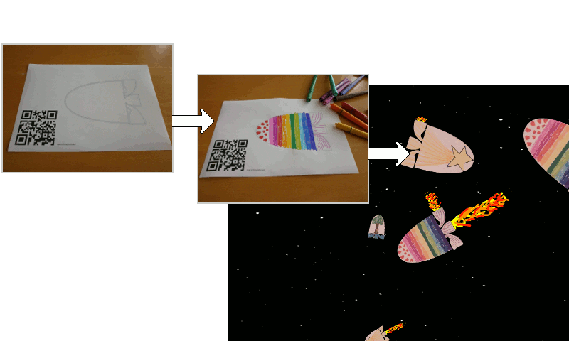
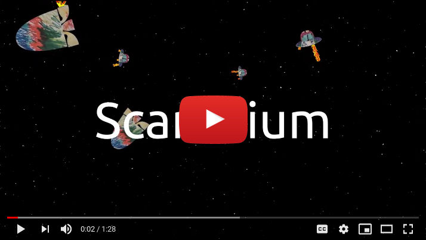

# Scanarium

[Documentation Index](docs/index.md)



Scanarium takes your filled in coloring pages and lets them come to life, by
animating them in a given set of scenes. Scanarium should be resource-friendly
to run on old hardware, and can be viewed on any modern browser or mobile phone.

[](https://www.youtube.com/watch?v=LuFLBiLtP8Y)

## Live Demo

At [https://demo.scanarium.com/](https://demo.scanarium.com/) Scanarium is running
live. Uploading files has been disabled to avoid creepy content. But the site is
good enough to show what you can expect.


## Installation / Quick-start guide

See [INSTALL.md](INSTALL.md)


## Directory structure

```
.
├── backend         -- All backend services (Python)
├── commands        -- Files that trigger commands when scanned
├── conf            -- Configuration files
├── docs            -- Documentation files
├── dynamic         -- Dynamic, scanned content (generated by setup.sh)
├── dynamic.sample  -- Some sample content for initial deployment
├── frontend        -- All frontend files (JavaScript)
├── images          -- General purpos images (See `scenes` for scene images)
├── localization    -- Localization files
├── maintenance     -- Files/scripts to ease maintenance
├── scanarium       -- Python library to support `backend` scripts
├── scenes          -- Static data for scenes, actors (i.e. rockets,...) etc.
├── services        -- Auxiliary service (e.g.: Scanning service, webserver)
└── tests           -- Tests for the Python part of the code
```


[Documentation Index](docs/index.md)
