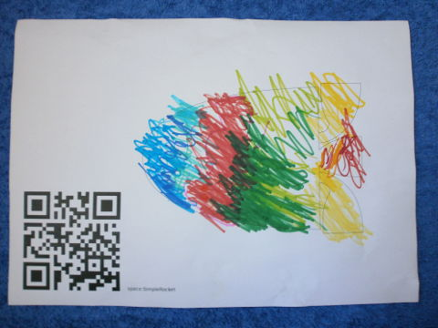
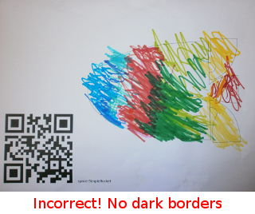
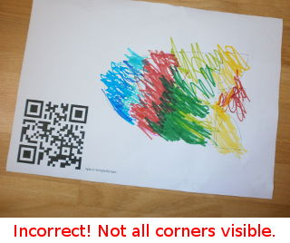
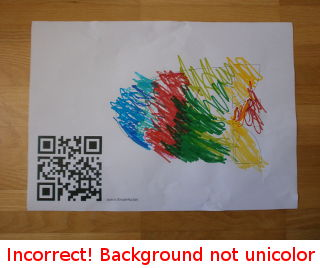
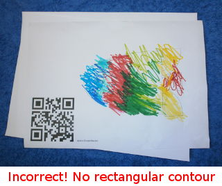

# Camera setup

[Documentation Index](index.md)

Scanarium takes the largest rectangle contour it finds as coloring page.

As long as the coloring page is the largest rectangle contour of the camera's
image, it does not matter much, whether the coloring page is portrait or
landscape, upright or flat, rotated or aligned. Scanarium will sort things out.

For best results, use a dark unicolor background (bigger dark piece of paper,
dark towel, dark piece of cloth, ...), put a sample sheet of paper on it and
check that the whole page with a small border is visible through the camera. To
get the camera's picture, you can choose the `show-source.sh` command from the
repo's root (or press `s` in the scanarium web browser tab, if you white-listed
that). It should look like:

Here's the list of things to pay attention to:

* The image has to be bordered by dark background.

* All 4 corners of the paper should be visible.

* Background should be a single dark uniform color without hard lines (which
might be picked up as contours). A bit of texture (e.g.: that of a unicolored
towel) is ok, as long as they are to long straight lines (e.g.: parquet floor),
as they might be taken as part of the page's contour.

* The paper should show a rectangular contour.

## Lessons learnt

* If Scanarium is running, and you have you browser it full-screen, it can be
tedious to switch to a terminal and re-adjusting the camera. If you can trust
the environment, it's easier if you set `cgi:show-source.allow` to `True` in
`conf/scanarium.conf`. Then, you simply press `s` in the full-screen browser
window, and the camera picture will pop up. Once done with re-adjusting the
camera, simply press enter in the camera window, and in disappears again.

* If you scan from the floor, kids will sometimes accidentaly step on the
background and/or move it around. Tape the background to the floor on off-camera
spots. This helps to keep it in place.

* Mark the background spot where the color pages should go. Either by keeping a
blank page there, or, even better, by marking the spot on the background with
some white tape, so kids cannot accidentally move it.

[Documentation Index](index.md)
